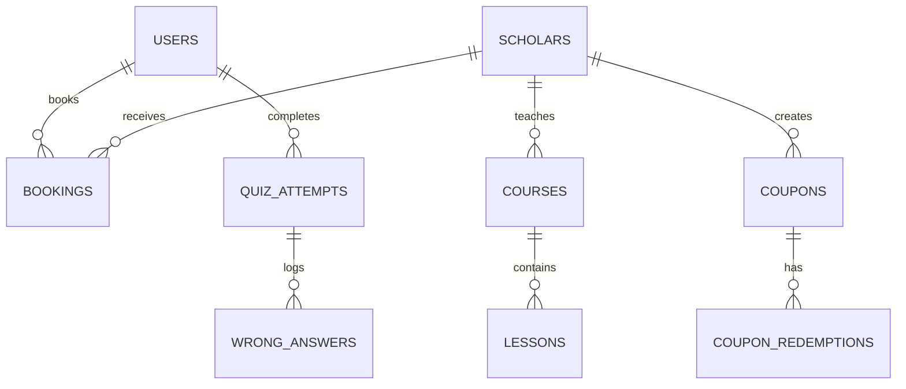

# 📖 Steadfast Deen — Full System Overview & Backend Architecture Plan
> **Document Purpose:** Complete specification detailing all existing frontend features of the **Steadfast Deen** platform and a step-by-step technical blueprint for building the production Backend system.

---

## 🟢 PART 1: Website System Overview (Frontend Mein Kya Kya Ho Raha Hai)

Currently, the **Steadfast Deen** frontend is a multi-role, feature-rich Islamic Learning, Scholar Consultation, and AI Analytics Web Application. It contains **3 distinct user roles** and over **20+ interactive screens**.

### 1. 👥 Multi-Role User System
- **👤 Student Account (`student@steadfastdeen.com`)**:
  - Browse verified Islamic Scholars and filter by specialization (Islamic Finance, Fiqh, Tajweed, Family Counseling, etc.).
  - Book 1-on-1 consultations (Voice Call, Video Session, or Real-time Chat).
  - Enroll in self-paced courses, watch video lessons, read summaries, and download PDF notes.
  - Apply Teacher & Admin promo coupon codes (`DEEN20`, `FAMILY15`, `SPECIAL50`) at checkout for instant discounts.
  - Take automated MCQ Assessment Quizzes with real-time topic strength/weakness feedback.
  - View personal Dashboard, Enrolled Courses, Consultation Records, Verified Certificates, and MCQ Test History.
  
- **👳‍♂️ Teacher / Scholar Account (`teacher@steadfastdeen.com`)**:
  - Dedicated Scholar Portal to manage courses, lessons, and live call timings (e.g. `07:00 PM – 09:00 PM PKT`).
  - **Coupons Manager**: Create custom promotional discount codes (`DEEN20`, 20% off) for students and track coupon redemptions, expiry dates, and revenue generated.
  - **MCQ Test Publisher**: Build course-specific MCQ evaluation questions with 4 options and correct answer keys.
  - **Student Access & Permissions**: View enrolled student roster and exercise teacher permissions to **Restrict** or **Block** student accounts.
  - **Live Call Receiver Terminal**: Receive instant incoming audio/video consultation call requests from students.
  - **Wallet & Payouts**: View wallet balance breakdown (₹125,000), submit bank payout withdrawal requests, and view payout logs.
  - **Profile & Slots**: Edit scholar bio, qualifications, hourly consultation rate, and available days/times.

- **👑 Super Admin Command Center (`admin@steadfastdeen.com`)**:
  - **Master Financial Dashboard**: Track platform revenue, profit splits (30%), expert payouts, and operational costs.
  - **Teacher Onboarding & Credential Generator**: Onboard scholars and use the **Auto-Suggest Credentials** tool to generate secure Login Usernames & Passwords for teachers.
  - **Behavior Analytics & AI Monitoring**: High-demand topics tracker (Islamic Finance 42% share, Family & Marriage 28% share), scholar engagement leaderboards, and AI recommendations (e.g. *"Onboard 2 additional certified Islamic Finance scholars"*).
  - **Predictive Revenue Forecasting**: 6-month historical revenue trend paired with AI-projected future 6-month growth trajectories and Q4 revenue targets.
  - **New Service Ideas Generator**: Proactive AI suggestions for new courses and consultation services based on user search queries.
  - **Master Coupons & Redemption Tracking**: Full control over site-wide coupons with a Student Redemption History inspector.
  - **Moderation & Approvals**: Approve pending scholar applications and moderate user reviews/comments.

---

### 2. 📚 Key Platform Features & Modules
1. **1-on-1 Scholar Consultations**: Search, profile view, slot booking, instant call launcher, and encrypted chat room.
2. **Learning Management System (LMS)**: Course catalog, category filtering, video lessons player, curriculum sections, downloadable PDF resources, and certificates generator.
3. **Automated MCQ Assessment Engine**: 
   - Questions across Aqeedah, Fiqh, Quran, Seerah, Hadith, and Islamic Finance.
   - Comprehensive Score Card (Total Questions, Correct, Incorrect, Marks, Percentage %, Score Badge).
   - Wrong Answers Analysis with scholar explanations.
   - Topic Strength 💪 vs Weakness ⚠️ breakdown.
   - Saved Student Performance History (`Test 1: 55%`, `Test 2: 68%`, `Test 3: 80%`).
4. **Coupons & Promotional System**: Promo input box at checkout (`CheckoutPage.tsx`), discount recalculation, teacher attribution, and redemption history tracking.
5. **Real-time Live Audio/Video Call Room**: WebRTC call room modal simulation with mute, camera toggle, and timer.

---

## 🔵 PART 2: Backend Architecture Blueprint (Backend Mein Kya Kya Banega)

To turn this frontend into a full production application, the backend will manage **Authentication**, **Database Models**, **REST APIs**, **WebSockets**, **Payment Gateways**, and **AI Analytics Jobs**.

### 🛠️ Recommended Tech Stack
- **Runtime & Framework**: Node.js with TypeScript (`Express.js` or `NestJS`) or `Next.js API Routes`
- **Database**: PostgreSQL (Relational DB for financial accuracy & structured data)
- **ORM / Query Builder**: Prisma ORM or TypeORM
- **Cache & Realtime State**: Redis (Session management, live call signaling, rate limiting)
- **WebSockets**: Socket.io (Real-time student-scholar chat & WebRTC video call signaling)
- **File & Video Storage**: AWS S3 / Cloudinary (Profile avatars, course video streams, PDF notes, certificates)
- **Payment Processing**: Stripe API / WooCommerce Webhooks / Razorpay / PayPal
- **Authentication**: JWT (JSON Web Tokens) with HttpOnly Refresh Cookies & Argon2/Bcrypt password hashing

---

### 🗄️ Database Schema & Entities (Database Tables)



#### Table Definitions:
1. **`users` Table**:
   - `id` (UUID, Primary Key)
   - `name`, `email`, `username`, `password_hash`
   - `role` (`'student'`, `'teacher'`, `'admin'`)
   - `avatar_url`, `phone`, `location`, `bio`
   - `status` (`'Active'`, `'Restricted'`, `'Blocked'`)
   - `created_at`, `updated_at`

2. **`scholars` Table**:
   - `id` (UUID, Primary Key)
   - `user_id` (Foreign Key -> `users.id`)
   - `title` (e.g. `Mufti`, `Dr.`, `Ustadh`)
   - `specialization` (e.g. `Islamic Finance`)
   - `hourly_rate`, `flat_session_price`
   - `live_call_timing_slot` (e.g. `07:00 PM - 09:00 PM PKT`)
   - `available_days` (JSON Array: `["Mon", "Wed", "Fri"]`)
   - `is_online` (Boolean), `verified` (Boolean)
   - `wallet_balance`, `total_revenue`

3. **`courses` & `lessons` Tables**:
   - `courses`: `id`, `slug`, `title`, `description`, `price`, `instructor_id`, `category_id`, `thumbnail_url`
   - `lessons`: `id`, `course_id`, `title`, `video_url`, `pdf_url`, `duration`, `lesson_order`

4. **`bookings` / `consultations` Table**:
   - `id` (UUID, Primary Key)
   - `student_id` (FK -> `users.id`), `scholar_id` (FK -> `scholars.id`)
   - `consultation_type` (`'chat'`, `'voice'`, `'video'`)
   - `date`, `time_slot`, `duration_mins`
   - `original_price`, `discount_amount`, `final_amount_paid`
   - `coupon_code_used` (Optional)
   - `status` (`'pending'`, `'confirmed'`, `'completed'`, `'cancelled'`)

5. **`coupons` & `coupon_redemptions` Tables**:
   - `coupons`: `id`, `code` (Unique), `creator_id`, `discount_percent`, `valid_until`, `max_uses`, `used_count`, `target_scope`, `is_active`, `total_revenue_generated`
   - `coupon_redemptions`: `id`, `coupon_id`, `student_id`, `booking_id`, `discount_saved`, `final_paid`, `redeemed_at`

6. **`mcq_questions` & `quiz_attempts` Tables**:
   - `mcq_questions`: `id`, `question_text`, `options_json`, `correct_key`, `topic` (`Aqeedah`, `Fiqh`, `Hadith`, `Quran`, `Finance`), `explanation`
   - `quiz_attempts`: `id`, `student_id`, `score_percentage`, `marks_obtained`, `total_marks`, `overall_badge`, `topic_breakdown_json`, `created_at`
   - `quiz_wrong_answers`: `id`, `quiz_attempt_id`, `question_id`, `user_selected_key`, `correct_key`

7. **`payout_requests` Table**:
   - `id`, `scholar_id`, `amount`, `bank_iban`, `status` (`'pending'`, `'approved'`, `'rejected'`), `requested_at`

8. **`user_behavior_analytics` Table**:
   - `id`, `search_query`, `category_searched`, `scholar_clicked_id`, `timestamp`

---

### 📡 API Endpoints Specification (Backend Routes)

#### 🔑 1. Auth & User Management Routes (`/api/v1/auth`)
- `POST /api/v1/auth/register` — Register a new student.
- `POST /api/v1/auth/login` — Log in for Student, Teacher, or Admin. Returns JWT token & role.
- `GET /api/v1/auth/me` — Fetch current logged-in user profile.
- `POST /api/v1/auth/logout` — Invalidate refresh token cookie.

#### 👳‍♂️ 2. Teacher & Scholar Routes (`/api/v1/teachers`)
- `GET /api/v1/teachers` — List all verified scholars with filtering.
- `GET /api/v1/teachers/:id` — Get detailed scholar profile & slots.
- `PUT /api/v1/teachers/profile` — Update scholar bio, timing slots, and hourly rates (Teacher only).
- `GET /api/v1/teachers/students` — List enrolled students with Teacher controls (**Block** / **Restrict**).
- `POST /api/v1/teachers/payout-request` — Submit wallet withdrawal request.

#### 👑 3. Admin Management Routes (`/api/v1/admin`)
- `POST /api/v1/admin/teachers/register` — Onboard new teacher & generate suggested credentials.
- `GET /api/v1/admin/teachers` — List all onboarded teacher accounts & credentials.
- `PUT /api/v1/admin/teachers/:id/status` — Suspend or activate a teacher.
- `GET /api/v1/admin/finance-summary` — Real-time profit, revenue, and payout balance.
- `GET /api/v1/admin/analytics/high-demand` — Real-time search & topic volume statistics.
- `GET /api/v1/admin/analytics/revenue-forecast` — Historical & AI projected revenue trends.
- `GET /api/v1/admin/analytics/suggestions` — Auto-generated new service/course ideas.

#### 📅 4. Consultations & Checkout Routes (`/api/v1/bookings`)
- `POST /api/v1/bookings/create` — Draft consultation booking.
- `POST /api/v1/bookings/checkout` — Apply coupon code, calculate total, process payment, and confirm booking.
- `GET /api/v1/bookings/my-sessions` — Get user's active/past consultations.

#### 🎟️ 5. Coupons Routes (`/api/v1/coupons`)
- `POST /api/v1/coupons/create` — Create coupon (Teacher or Admin).
- `POST /api/v1/coupons/validate` — Validate coupon code at checkout.
- `GET /api/v1/coupons` — List created coupons with redemption counts.
- `GET /api/v1/coupons/:id/redemptions` — Get exact student redemption history for a coupon.

#### 🧠 6. MCQ Assessment & Analytics Routes (`/api/v1/quiz`)
- `GET /api/v1/quiz/questions` — Fetch assessment question bank.
- `POST /api/v1/quiz/submit` — Submit answers, calculate score %, generate topic strength/weakness breakdown, and log wrong answers.
- `GET /api/v1/quiz/history` — Get student's previous test attempt records.

---

### 🌐 Real-Time Signaling & WebSockets (Socket.io Events)
- `join-chat-room` — Connect student and scholar to encrypted chat session.
- `send-message` — Broadcast instant text, voice note, or document.
- `call-invite` — Trigger incoming voice/video call alert to scholar terminal.
- `call-accept` / `call-reject` — Establish WebRTC peer-to-peer audio/video connection.

---

## ⚡ Execution Roadmap & Next Steps

```
[Phase 1: Database & Auth Setup]
  ├── Setup Node.js/Express + Prisma ORM + PostgreSQL
  ├── Implement JWT Authentication & Role-Based Middleware (Student/Teacher/Admin)
  └── Seed initial database data (Scholars, Courses, Categories, MCQ Questions)

[Phase 2: Core Business APIs]
  ├── Consultations & Booking API
  ├── Checkout & Payment Gateway Integration (Stripe/WooCommerce)
  └── Coupons & Student Redemption History Engine

[Phase 3: MCQ Quiz Engine & Analytics]
  ├── Quiz submission evaluator & topic weakness calculator
  └── Admin AI Analytics, High Demand Tracker & Revenue Forecasting API

[Phase 4: Real-time Signaling & Media]
  ├── Socket.io encrypted chat backend
  └── WebRTC audio/video call signaling server
```

---

*This specification document is completely aligned with the Steadfast Deen frontend application codebase.*
